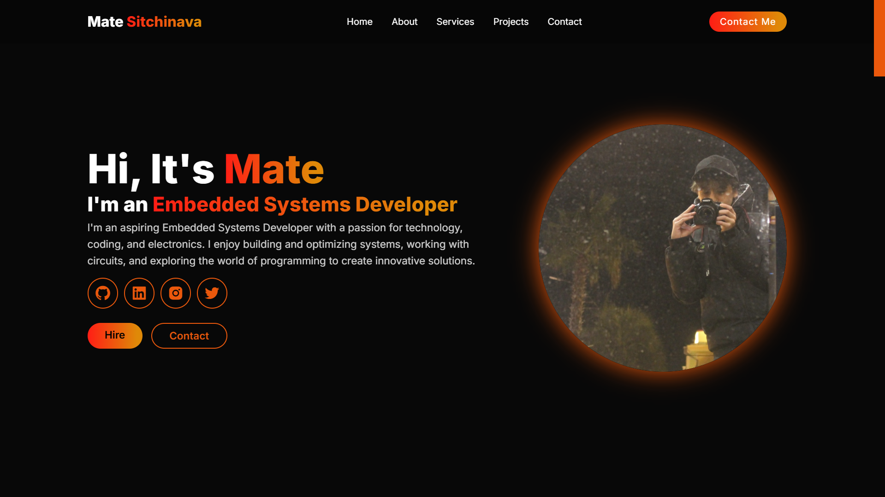

# Portfolio Website  

🚀 **Live Demo**: [https://matesoft.netlify.app/](https://matesoft.netlify.app/) 

## 📌 Overview  
This is my personal portfolio website, built to showcase my projects, skills, and experience. It features a clean, responsive design with smooth animations to provide a great user experience.  

## 🔧 Technologies Used  
- **Frontend:** HTML, CSS, JavaScript  
- **Other:** Git, GitHub Pages (if deployed there)  

## 📷 Preview  


## ⚡ Features  
✅ Fully responsive design  
✅ Smooth animations & transitions  
✅ Dark/Light mode (if applicable)  
✅ Contact form with email functionality (if applicable)  
✅ Hosted online for easy access  

## 📂 Folder Structure  
```
📂 portfolio-website  
 ├── 📜 index.html    # Main HTML file  
 ├── 📜 styles.css    # Main CSS file  
 ├── 📜 script.js     # Main JavaScript file  
 ├── 📜 README.md     # Documentation  
 ├── 📜 LICENSE       # Open-source license (MIT recommended)  
 ├── 📜 .gitignore    # Ignore unnecessary files  
```

## 🛠️ Installation & Setup  
To run the portfolio locally, follow these steps:  

```sh
git clone https://github.com/matesoft2033/portfolio-website.git  
cd portfolio-website  
open index.html   
```

## 🎯 Deployment  
- Hosted using **Netlify**  
- Deployed at: `https://matesoft.netlify.app/`  

## 🤝 Contributing  
If you'd like to improve this project, feel free to fork the repository, make changes, and submit a pull request.  

## 📜 License  
This project is licensed under the **MIT License**.  
